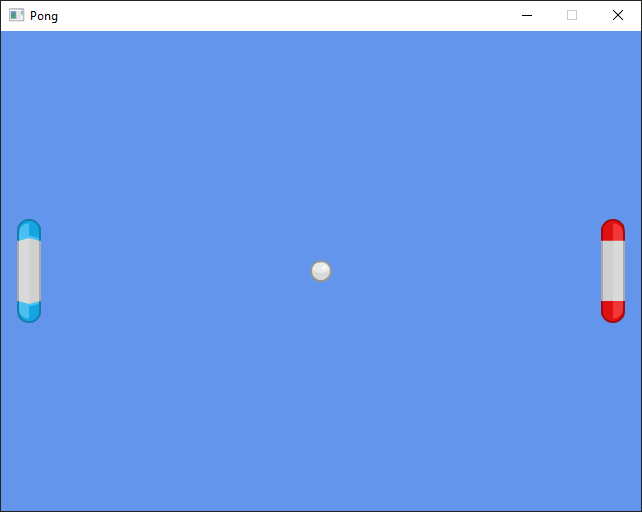

# Tutorial: Pong

In this tutorial, we'll build a simple Pong clone using Tetra.

    

This guide is targeted at people who have a basic understanding of Rust, but might not have done any game development before. If you have read [*The Rust Programming Language*](https://doc.rust-lang.org/book/), you should be able to follow along without getting lost - if you can't, please [file an issue](https://github.com/17cupsofcoffee/tetra/issues) so I can fix that!

## Contents

1. [Creating a Project](./01-creating-a-project.md)
2. [Adding the Paddles](./02-adding-the-paddles.md)
3. [Adding a Ball](./03-adding-a-ball.md)