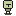

# Loading a Texture

In the [last chapter](./getting-started.md), we got a basic window on the screen, and displayed some text. Now let's take it one step further, and display an image from a file.

If you didn't follow along with the previous chapter, copy [the final code](getting-started.md#next-steps) into your `main.rs`.

## Adding a Texture to GameState

For this example, we'll use a sprite that I drew - excuse the programmer art:

[](./player.png)

Save that image to the root of your project. We can now load it in our `GameState` constructor:

```rust ,noplaypen
use tetra::graphics::{Texture, Vec2};
use tetra::Context;

struct GameState {
    texture: Texture,
    position: Vec2,
}

impl GameState {
    fn new(ctx: &mut Context) -> tetra::Result<GameState> {
        Ok(GameState {
            texture: Texture::new(ctx, "./player.png")?,
            position: Vec2::new(0.0, 0.0),
        })
    }
}
```

Note that:

* We now need to pass the `Context` into the constructor so that we can pass it to `Texture::new` - this is so the texture can be loaded into your GPU memory.
* `Texture::new` can fail (e.g. if you enter the wrong path), so we need to return `tetra::Result<GameState>` instead of just `GameState`.

The game logic should pretty much stay the same, although you'll need to amend your `draw` method to replace `self.text` with `self.texture`.

## Constructing the State

If you try to run your game now, you'll get a couple of compile errors, due to the changes we made to our constructor:

```
error[E0061]: this function takes 1 parameter but 0 parameters were supplied
  --> main.rs:39:10
   |
10 |     fn new(ctx: &mut Context) -> tetra::Result<GameState> {
   |     ----------------------------------------------------- defined here
...
39 |         .run(&mut GameState::new())
   |                   ^^^^^^^^^^^^^^^^ expected 1 parameter

error[E0277]: the trait bound `std::result::Result<GameState, tetra::error::TetraError>: tetra::State` is not satisfied
  --> main.rs:39:10
   |
39 |         .run(&mut GameState::new())
   |          ^^^ the trait `tetra::State` is not implemented for `std::result::Result<GameState, tetra::error::TetraError>`
```

The obvious solution would be to write something like this:

```rust ,noplaypen
fn main() -> tetra::Result {
    let mut ctx = ContextBuilder::new("My First Tetra Game", 1280, 720)
        .build()?;

    let mut state = GameState::new(&mut ctx)?;

    ctx.run(&mut state)
}
```

But wait, there's a simpler way! `Context` provides a method called `run_with` that will use a closure to initialize your state before running the game:

```rust ,noplaypen
fn main() -> tetra::Result {
    ContextBuilder::new("My First Tetra Game", 1280, 720)
        .build()?
        .run_with(|ctx| GameState::new(ctx))
}
```

And since our constructor's function signature is the same as that of the closure that `run_with` expects, we can simplify this even further:

```rust ,noplaypen
fn main() -> tetra::Result {
    ContextBuilder::new("My First Tetra Game", 1280, 720)
        .build()?
        .run_with(GameState::new)
}
```

Much nicer! If you run the game now, you should see our little knight running across the screen!

## Next Steps

This is currently the last chapter of the tutorial (although more will be added in the future). To learn more about using Tetra, check out the [API documentation](https://docs.rs/tetra/), or look at the [examples](https://github.com/17cupsofcoffee/tetra/tree/master/examples) on GitHub.

Here's the full example from this chapter:

```rust ,noplaypen
use tetra::graphics::{self, Color, Texture, Vec2};
use tetra::{State, Context, ContextBuilder};

struct GameState {
    texture: Texture,
    position: Vec2,
}

impl GameState {
    fn new(ctx: &mut Context) -> tetra::Result<GameState> {
        Ok(GameState {
            texture: Texture::new(ctx, "./player.png")?,
            position: Vec2::new(0.0, 0.0),
        })
    }
}

impl State for GameState {
    fn update(&mut self, ctx: &mut Context) -> tetra::Result {
        self.position.x += 1.0;

        Ok(())
    }

    fn draw(&mut self, ctx: &mut Context, _dt: f64) -> tetra::Result {
        graphics::clear(ctx, Color::rgb(0.392, 0.584, 0.929));
        graphics::draw(ctx, &self.texture, self.position);

        Ok(())
    }
}

fn main() -> tetra::Result {
    ContextBuilder::new("My First Tetra Game", 1280, 720)
        .build()?
        .run_with(GameState::new)
}
```
